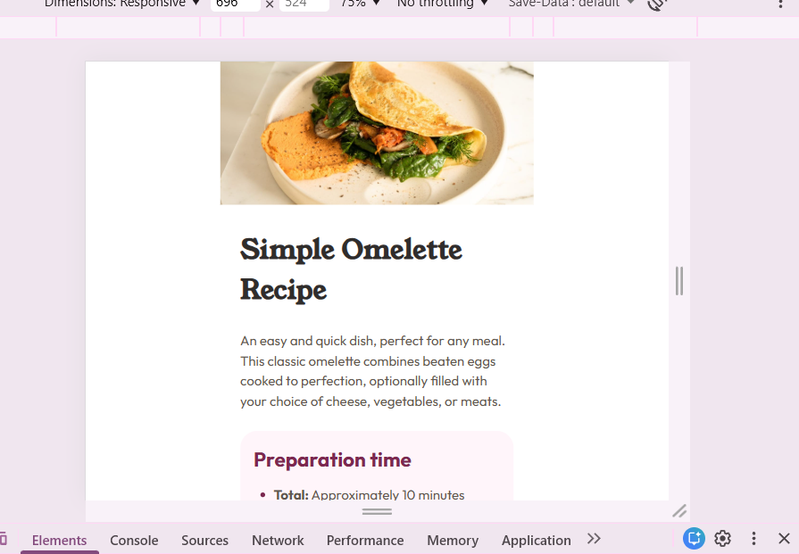
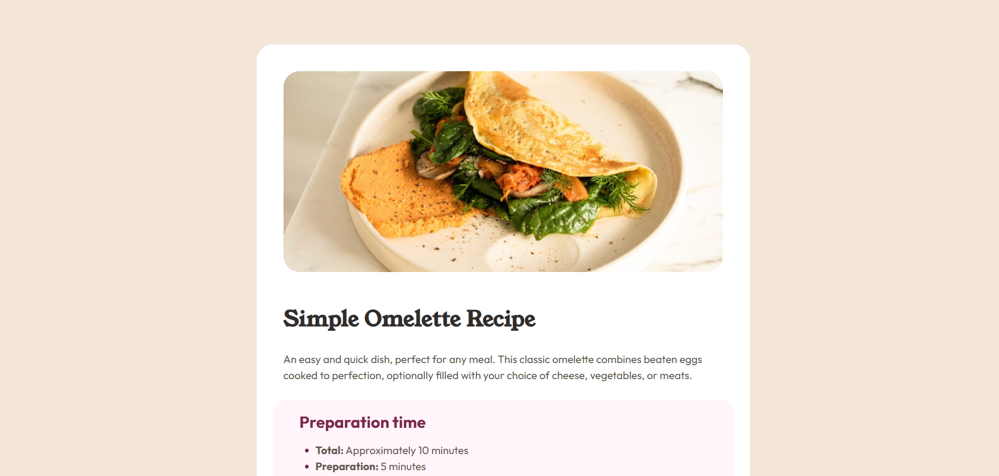

# Frontend Mentor - Recipe page solution

This is my solution to the [Recipe page challenge on Frontend Mentor](https://www.frontendmentor.io/challenges/recipe-page-KiTsR8QQKm). These challenges help improve real-world coding skills by building responsive and accessible projects.

## Table of contents

- [Overview](#overview)
  - [Screenshot](#screenshot)
  - [Links](#links)
- [My process](#my-process)
  - [Built with](#built-with)
  - [What I learned](#what-i-learned)
  - [Continued development](#continued-development)
- [Author](#author)

## Overview

### Screenshot




### Links

- Solution URL: [GitHub](https://github.com/Vall-Re/frontend_developer-recipe-page)
- Live Site URL: [Demo](https://vall-re.github.io/frontend_developer-recipe-page/)

## My process

### Built with

- Semantic HTML5 markup
- CSS custom properties
- Flexbox
- CSS Grid
- Mobile-first workflow

### What I learned

This project helped me strengthen my understanding of:

- Writing clean, semantic HTML structure

- Using CSS variables for consistent theming

- Creating responsive layouts using Flexbox and Grid

- Improving spacing and typography for better UI design

```html
<section class="recipe-instructions">
  <h2>Instructions</h2>
  <ol>
    <li><strong>Beat the eggs:</strong> In a bowl, beat the eggs with salt and pepper.</li>
    <li><strong>Heat the pan:</strong> Place a non-stick pan over medium heat.</li>
    <li><strong>Cook the omelette:</strong> Pour the mixture and cook until set.</li>
  </ol>
</section>
```
And using CSS variables for consistency:

```css
:root {
  --white: hsl(0, 0%, 100%);
  --stone-100: hsl(30, 54%, 90%);
  --stone-150: hsl(30, 18%, 87%);
  --stone-600: hsl(30, 10%, 34%);
  --stone-900: hsl(24, 5%, 18%);
  --brown-800: hsl(14, 45%, 36%);
  --rose-50: hsl(330, 100%, 98%);
  --rose-800: hsl(332, 51%, 32%);
}

body {
  margin: 0;
  padding: 0;
  background-color: var(--white);
  color: var(--stone-900);
  font-family: 'Outfit', sans-serif;
  font-weight: 400;
  font-size: 16px;
  line-height: 1.5;
}
```

### Continued development

In future projects, I want to:

- Improve accessibility (ARIA roles, better semantic choices)

- Refine responsive typography techniques

- Write cleaner and more reusable CSS

- Practice structuring projects for scalability

## Author

- Website - [GitHub](https://github.com/Vall-Re)
- Frontend Mentor - [@Vall-Re](https://www.frontendmentor.io/profile/Vall-Re)
